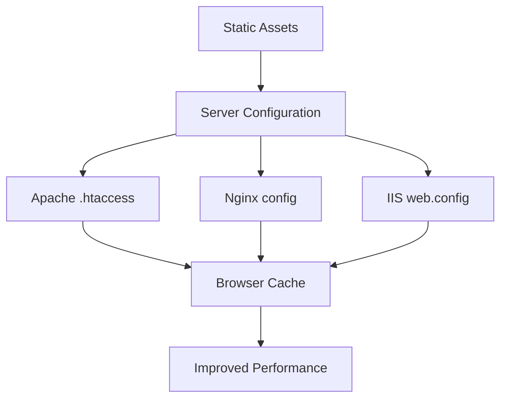

# Design Document - Expires Headers Implementation

## Overview

This design implements HTTP Expires headers for static assets to improve website performance through browser caching. Since this is a static website, the implementation will focus on server configuration files that can be deployed alongside the static assets to configure caching behavior on common web servers (Apache, Nginx, IIS).

## Architecture

The solution consists of multiple server configuration files to support different hosting environments:



## Components and Interfaces

### 1. Apache Configuration (.htaccess)
- **Purpose**: Configure caching for Apache web servers
- **Location**: Root directory of the website
- **Functionality**: 
  - Set Expires headers for different file types
  - Configure Cache-Control headers
  - Enable ETag generation

### 2. Nginx Configuration (nginx.conf snippet)
- **Purpose**: Provide configuration directives for Nginx servers
- **Location**: Separate configuration file for reference
- **Functionality**:
  - Location blocks for different asset types
  - Expires directives
  - Cache-Control headers

### 3. IIS Configuration (web.config)
- **Purpose**: Configure caching for IIS/Windows servers
- **Location**: Root directory of the website
- **Functionality**:
  - Static content caching rules
  - Client cache directives
  - MIME type specific caching

### 4. Meta Tags for HTML Caching
- **Purpose**: Provide fallback caching hints for HTML content
- **Location**: HTML head section
- **Functionality**:
  - Cache-Control meta tags
  - Pragma directives for older browsers

## Data Models

### Cache Configuration Schema
```typescript
interface CacheConfig {
  fileType: string;
  maxAge: number; // in seconds
  expires: string; // relative time format
  cacheControl: string;
  includeETag: boolean;
}
```

### Asset Type Mappings
- **Long-term cache (1 year)**: CSS, JS, fonts, versioned assets
- **Medium-term cache (1 month)**: Images (webp, svg, ico, webm, jpg, png)
- **Short-term cache (1 hour)**: HTML files
- **No cache**: Dynamic content, API responses

## Error Handling

### Server Configuration Errors
- **Invalid directives**: Provide fallback configurations
- **Unsupported modules**: Include conditional checks
- **Syntax errors**: Validate configuration syntax

### Browser Compatibility
- **Legacy browsers**: Include Pragma headers for HTTP/1.0 compatibility
- **Cache validation**: Implement proper ETag and Last-Modified headers
- **Cache busting**: Support for query parameters and versioning

## Testing Strategy

### 1. Configuration Validation
- Syntax validation for each server type
- Module dependency checks
- Directive compatibility verification

### 2. Cache Header Verification
- HTTP response header inspection
- Browser developer tools testing
- Cache behavior validation across different browsers

### 3. Performance Testing
- Before/after performance comparison
- Cache hit rate measurement
- Page load time analysis

### 4. Cross-Server Testing
- Apache server testing
- Nginx server testing
- IIS server testing
- Static hosting services (Netlify, Vercel, GitHub Pages)

## Implementation Details

### Cache Duration Strategy
- **CSS/JS Files**: 31536000 seconds (1 year) - These files should be versioned
- **Images**: 2592000 seconds (30 days) - Balance between performance and updates
- **HTML**: 3600 seconds (1 hour) - Allow for content updates while providing some caching
- **Fonts**: 31536000 seconds (1 year) - Rarely change once deployed

### Header Configuration
Each asset type will include:
- `Expires`: Absolute expiration date
- `Cache-Control`: Modern caching directives with max-age
- `ETag`: Entity tag for cache validation
- `Last-Modified`: File modification timestamp

### Fallback Strategy
1. Primary: Server-level configuration files
2. Secondary: Meta tags in HTML for basic caching
3. Tertiary: JavaScript-based cache management for dynamic content

## Security Considerations

- Avoid caching sensitive content
- Implement proper cache validation
- Consider cache poisoning prevention
- Ensure proper CORS headers for cached assets

## Deployment Strategy

1. **Development**: Test configurations locally with different server setups
2. **Staging**: Validate cache behavior in production-like environment
3. **Production**: Deploy configuration files alongside static assets
4. **Monitoring**: Track cache hit rates and performance improvements