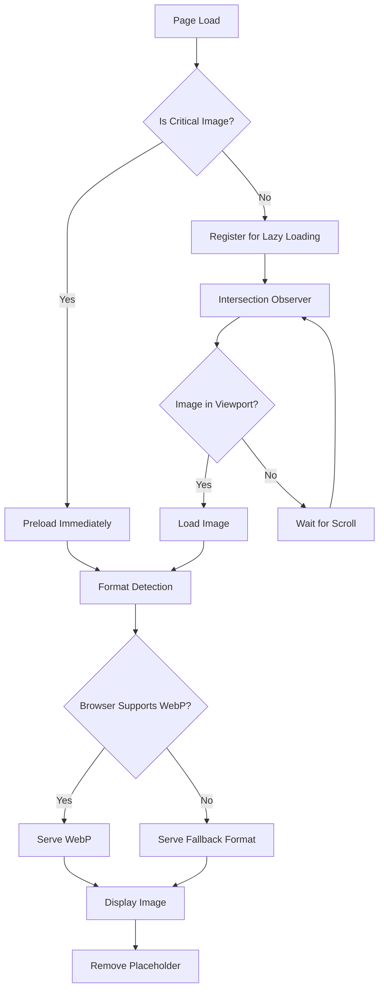

# Design Document

## Overview

El sistema de optimización de imágenes e iconos para Agrolinx implementará técnicas modernas de carga y optimización para mejorar significativamente el rendimiento de la página web. El diseño se enfoca en reducir los tiempos de carga inicial, implementar lazy loading inteligente, optimizar formatos de imagen y crear un sistema de iconos eficiente.

### Objetivos del Diseño
- Reducir el tiempo de carga inicial en un 40-60%
- Implementar lazy loading para imágenes fuera del viewport
- Optimizar el sistema de iconos eliminando dependencias externas
- Proporcionar fallbacks robustos para diferentes navegadores
- Mantener la calidad visual mientras se optimiza el rendimiento

## Architecture

### Componentes Principales

```
Image Optimization System
├── Critical Image Preloader
├── Lazy Loading Manager
├── Format Detection & Serving
├── Icon System Manager
├── Placeholder & Loading States
└── Performance Monitor
```

### Flujo de Carga de Imágenes



## Components and Interfaces

### 1. Critical Image Preloader

**Propósito:** Cargar inmediatamente las imágenes críticas para el viewport inicial.

**Interfaz:**
```javascript
class CriticalImagePreloader {
  constructor(criticalImages)
  preloadImages()
  addCriticalImage(imageConfig)
  onImageLoad(callback)
}
```

**Imágenes Críticas Identificadas:**
- Logo del header (`/imag/logodar.webp`)
- Imagen hero principal (`/imag/d.webp`)
- Favicon (`/imag/icon.ico`)

### 2. Lazy Loading Manager

**Propósito:** Gestionar la carga diferida de imágenes no críticas.

**Interfaz:**
```javascript
class LazyLoadingManager {
  constructor(options)
  observe(imageElement)
  unobserve(imageElement)
  loadImage(imageElement)
  createPlaceholder(imageElement)
}
```

**Configuración:**
- Threshold: 0.1 (cargar cuando 10% de la imagen es visible)
- Root margin: "50px" (cargar 50px antes de que sea visible)
- Soporte para imágenes responsive con srcset

### 3. Format Detection & Serving

**Propósito:** Detectar capacidades del navegador y servir el formato óptimo.

**Interfaz:**
```javascript
class FormatDetector {
  static supportsWebP()
  static supportsAVIF()
  static getOptimalFormat(originalSrc)
  static generateSrcSet(basePath, sizes)
}
```

**Estrategia de Formatos:**
1. AVIF (si es soportado) - mejor compresión
2. WebP (si es soportado) - buena compresión y soporte amplio
3. JPEG/PNG (fallback) - compatibilidad universal

### 4. Icon System Manager

**Propósito:** Reemplazar Lucide Icons externa con sistema SVG optimizado.

**Interfaz:**
```javascript
class IconSystemManager {
  constructor(iconSprite)
  renderIcon(iconName, className)
  preloadCriticalIcons()
  replaceExternalIcons()
}
```

**Implementación:**
- SVG Sprite interno con iconos utilizados
- Eliminación de dependencia externa de Lucide
- Iconos críticos inline en el HTML
- Sistema de fallback para iconos no encontrados

### 5. Placeholder & Loading States

**Propósito:** Proporcionar feedback visual durante la carga de imágenes.

**Tipos de Placeholders:**
- **Skeleton Loading:** Para imágenes de contenido
- **Blur-up:** Para imágenes hero con versión de baja calidad
- **Color Placeholder:** Para logos y elementos simples
- **Progressive Loading:** Para imágenes grandes

**Interfaz:**
```javascript
class PlaceholderManager {
  createSkeletonPlaceholder(dimensions)
  createBlurPlaceholder(lowQualitySrc)
  createColorPlaceholder(dominantColor)
  animateImageReveal(imageElement)
}
```

## Data Models

### Image Configuration Model
```javascript
const ImageConfig = {
  src: String,           // Ruta original de la imagen
  alt: String,           // Texto alternativo
  critical: Boolean,     // Si es imagen crítica
  lazy: Boolean,         // Si debe usar lazy loading
  placeholder: {
    type: String,        // 'skeleton', 'blur', 'color'
    data: String         // Datos específicos del placeholder
  },
  responsive: {
    sizes: Array,        // Tamaños disponibles
    breakpoints: Array   // Breakpoints para responsive
  },
  formats: {
    webp: String,        // Ruta versión WebP
    avif: String,        // Ruta versión AVIF
    fallback: String     // Ruta fallback
  }
}
```

### Icon Configuration Model
```javascript
const IconConfig = {
  name: String,          // Nombre del icono
  svg: String,           // Contenido SVG
  critical: Boolean,     // Si debe cargarse inmediatamente
  size: String,          // Tamaño por defecto
  viewBox: String        // ViewBox del SVG
}
```

## Error Handling

### Estrategias de Manejo de Errores

1. **Image Load Failures:**
   - Fallback automático a formato alternativo
   - Placeholder de error con icono informativo
   - Retry automático con exponential backoff
   - Logging de errores para monitoreo

2. **Network Issues:**
   - Detección de conexión lenta
   - Carga de versiones de menor calidad
   - Modo offline con placeholders estáticos

3. **Browser Compatibility:**
   - Feature detection antes de usar APIs modernas
   - Polyfills para Intersection Observer
   - Fallbacks para navegadores antiguos

### Error Recovery
```javascript
class ErrorHandler {
  handleImageError(imageElement, error)
  retryImageLoad(imageElement, maxRetries)
  showErrorPlaceholder(imageElement)
  logError(error, context)
}
```

## Testing Strategy

### Unit Tests
- **Format Detection:** Verificar detección correcta de formatos soportados
- **Lazy Loading:** Probar carga diferida con diferentes configuraciones
- **Placeholder Generation:** Validar creación de placeholders
- **Icon System:** Verificar renderizado correcto de iconos

### Integration Tests
- **Image Loading Flow:** Probar flujo completo de carga de imágenes
- **Performance Impact:** Medir mejoras en métricas de rendimiento
- **Cross-browser Compatibility:** Verificar funcionamiento en diferentes navegadores
- **Network Conditions:** Probar con diferentes velocidades de conexión

### Performance Tests
- **Lighthouse Scores:** Mejorar puntuaciones de Performance y Best Practices
- **Core Web Vitals:** Optimizar LCP, FID y CLS
- **Bundle Size:** Verificar que optimizaciones no aumenten el tamaño del bundle
- **Memory Usage:** Monitorear uso de memoria durante carga de imágenes

### Test Scenarios
1. **Carga inicial:** Verificar que solo imágenes críticas se cargan inmediatamente
2. **Scroll behavior:** Confirmar que lazy loading funciona correctamente
3. **Format fallback:** Probar fallbacks en navegadores sin soporte WebP
4. **Error scenarios:** Verificar manejo de errores de carga
5. **Mobile performance:** Probar optimizaciones en dispositivos móviles

### Métricas de Éxito
- **Tiempo de carga inicial:** Reducción del 40-60%
- **Lighthouse Performance Score:** Incremento de al menos 20 puntos
- **First Contentful Paint (FCP):** Mejora del 30-50%
- **Largest Contentful Paint (LCP):** Reducción a menos de 2.5 segundos
- **Cumulative Layout Shift (CLS):** Mantener por debajo de 0.1

## Implementation Considerations

### Backward Compatibility
- Mantener funcionalidad en navegadores que no soportan Intersection Observer
- Fallbacks para navegadores sin soporte de formatos modernos
- Degradación elegante en conexiones lentas

### SEO Impact
- Mantener atributos alt apropiados
- Asegurar que imágenes críticas sean indexables
- Implementar structured data para imágenes cuando sea relevante

### Accessibility
- Preservar todos los atributos de accesibilidad
- Proporcionar feedback apropiado durante estados de carga
- Asegurar que placeholders no interfieran con lectores de pantalla

### Performance Budget
- Límite de 50KB para iconos SVG sprite
- Máximo 2MB para imágenes críticas
- Objetivo de menos de 100ms para inicialización del sistema