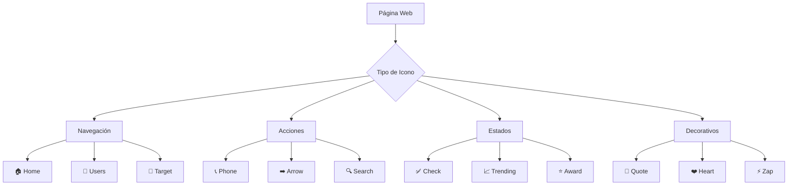

# Design Document - Eliminación de Lucide Icons

## Overview

Este diseño elimina la dependencia externa de Lucide Icons (aproximadamente 50KB) y la reemplaza con emojis nativos del sistema para mejorar significativamente el rendimiento de carga. Los emojis nativos no requieren descargas adicionales y son renderizados directamente por el sistema operativo.

## Architecture



## Components and Interfaces

### 1. Icon Mapping System
Mapeo completo de iconos Lucide a emojis nativos:

#### Navegación
- `home` → 🏠
- `users` → 👥  
- `target` → 🎯
- `handshake` → 🤝
- `image` → 🖼️

#### Acciones y Botones
- `phone` → 📞
- `arrow-right` → ➡️
- `chevron-down` → ⬇️
- `chevron-up` → ⬆️
- `external-link` → 🔗

#### Estados y Validación
- `check-circle` → ✅
- `trending-up` → 📈
- `award` → 🏆
- `shield-check` → 🛡️

#### Elementos Decorativos
- `heart` → ❤️
- `quote` → 💬
- `compass` → 🧭
- `lightbulb` → 💡
- `star` → ⭐

#### Tecnología y Herramientas
- `cpu` → 💻
- `zap` → ⚡
- `users-2` → 👥
- `map-pin` → 📍

### 2. CSS Adaptations
Ajustes necesarios en los estilos para emojis:

```css
.emoji-icon {
  font-size: inherit;
  line-height: 1;
  vertical-align: middle;
  font-family: "Apple Color Emoji", "Segoe UI Emoji", "Noto Color Emoji", sans-serif;
}
```

### 3. Fallback Strategy
Para navegadores que no soporten ciertos emojis:

```css
.emoji-fallback::before {
  content: "•";
  color: currentColor;
}
```

## Data Models

### Icon Replacement Map
```javascript
const iconMap = {
  // Navegación
  'home': '🏠',
  'users': '👥',
  'target': '🎯',
  'handshake': '🤝',
  'image': '🖼️',
  
  // Acciones
  'phone': '📞',
  'arrow-right': '➡️',
  'chevron-down': '⬇️',
  'chevron-up': '⬆️',
  'external-link': '🔗',
  
  // Estados
  'check-circle': '✅',
  'trending-up': '📈',
  'award': '🏆',
  'shield-check': '🛡️',
  
  // Decorativos
  'heart': '❤️',
  'quote': '💬',
  'compass': '🧭',
  'lightbulb': '💡',
  'star': '⭐',
  
  // Tecnología
  'cpu': '💻',
  'zap': '⚡',
  'users-2': '👥',
  'map-pin': '📍'
};
```

## Error Handling

### Emoji Compatibility
- **Fallback characters**: Si un emoji no se renderiza, usar caracteres Unicode básicos
- **Font stack**: Incluir múltiples fuentes de emoji para máxima compatibilidad
- **Size consistency**: Mantener tamaños consistentes entre emojis y texto

### Browser Support
- **Modern browsers**: Soporte nativo completo para emojis
- **Legacy browsers**: Fallback a caracteres simples
- **Mobile devices**: Emojis nativos del sistema operativo

## Testing Strategy

### 1. Visual Regression Testing
- Comparar apariencia antes/después en diferentes navegadores
- Verificar alineación y tamaños de emojis
- Validar contraste y legibilidad

### 2. Performance Testing
- Medir tiempo de carga antes/después
- Verificar reducción en tamaño de bundle
- Analizar métricas de Core Web Vitals

### 3. Cross-Platform Testing
- Windows (Segoe UI Emoji)
- macOS (Apple Color Emoji)  
- Android (Noto Color Emoji)
- iOS (Apple Color Emoji)

## Implementation Details

### Removal Process
1. **HTML Updates**: Reemplazar todos los `<i data-lucide="...">` con spans conteniendo emojis
2. **Script Removal**: Eliminar la carga de Lucide Icons del HTML
3. **CSS Updates**: Ajustar estilos para emojis nativos
4. **JavaScript Updates**: Actualizar cualquier referencia dinámica a iconos

### Performance Benefits
- **Reducción de bundle**: ~50KB menos de JavaScript
- **Menos requests HTTP**: Una dependencia externa menos
- **Renderizado más rápido**: Emojis nativos del sistema
- **Mejor caching**: Sin dependencias externas que actualizar

### Semantic Considerations
- Mantener el significado semántico original
- Usar `aria-label` cuando sea necesario
- Preservar la accesibilidad de los elementos

## Security Considerations

- Eliminar dependencia externa reduce superficie de ataque
- Emojis nativos no requieren validación de contenido
- Sin riesgo de CDN comprometido

## Deployment Strategy

1. **Preparación**: Crear mapeo completo de iconos
2. **Implementación**: Reemplazar iconos en HTML y CSS
3. **Limpieza**: Remover referencias a Lucide Icons
4. **Validación**: Verificar funcionalidad y apariencia
5. **Monitoreo**: Medir mejoras de rendimiento