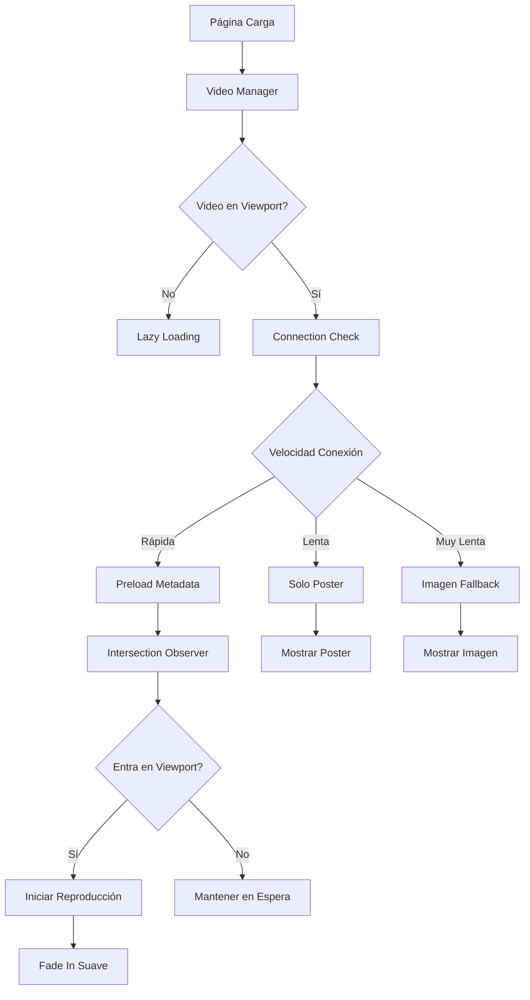

# Design Document - Optimización de Video WebM

## Overview

Este diseño implementa un sistema avanzado de optimización para videos WebM que incluye lazy loading inteligente, detección de conexión, preload adaptativo y fallbacks robustos. El objetivo es reducir el impacto en el rendimiento inicial mientras se mantiene una experiencia de usuario fluida.

## Architecture



## Components and Interfaces

### 1. VideoOptimizer Class
Clase principal que maneja toda la optimización del video:

```javascript
class VideoOptimizer {
  constructor(videoElement, options = {}) {
    this.video = videoElement;
    this.options = {
      threshold: 0.25,
      rootMargin: '50px',
      preloadDistance: 200,
      ...options
    };
  }
  
  init() {
    this.detectConnection();
    this.setupIntersectionObserver();
    this.setupEventListeners();
  }
}
```

### 2. Connection Detection
Sistema de detección de velocidad de conexión:

```javascript
class ConnectionDetector {
  static getConnectionSpeed() {
    const connection = navigator.connection || navigator.mozConnection || navigator.webkitConnection;
    if (connection) {
      return {
        effectiveType: connection.effectiveType,
        downlink: connection.downlink,
        saveData: connection.saveData
      };
    }
    return null;
  }
}
```

### 3. Lazy Loading Manager
Gestor de carga diferida usando Intersection Observer:

```javascript
class LazyVideoLoader {
  constructor(threshold = 0.25, rootMargin = '50px') {
    this.observer = new IntersectionObserver(
      this.handleIntersection.bind(this),
      { threshold, rootMargin }
    );
  }
  
  observe(videoElement) {
    this.observer.observe(videoElement);
  }
}
```

## Data Models

### Video Configuration
```javascript
const videoConfig = {
  // Configuración básica
  autoplay: true,
  muted: true,
  loop: true,
  playsinline: true,
  
  // Optimizaciones
  preload: 'none', // Cambiará dinámicamente
  loading: 'lazy',
  
  // Fallbacks
  poster: '/imag/ima9-poster.webp',
  fallbackImage: '/imag/ima9-fallback.webp',
  
  // Thresholds
  intersectionThreshold: 0.25,
  preloadDistance: 200,
  
  // Connection-based settings
  connectionSettings: {
    '4g': { preload: 'metadata', quality: 'high' },
    '3g': { preload: 'none', quality: 'medium' },
    '2g': { preload: 'none', quality: 'low', posterOnly: true },
    'slow-2g': { preload: 'none', posterOnly: true, showFallback: true }
  }
};
```

### Performance Metrics
```javascript
const performanceMetrics = {
  videoLoadTime: 0,
  firstFrameTime: 0,
  totalBytesLoaded: 0,
  connectionType: '',
  userAgent: '',
  viewportEntry: 0
};
```

## Error Handling

### Video Loading Errors
- **Network errors**: Fallback a imagen estática
- **Format not supported**: Fallback automático a imagen
- **Autoplay blocked**: Mostrar controles de reproducción
- **Timeout errors**: Retry con configuración más conservadora

### Browser Compatibility
- **No Intersection Observer**: Polyfill o fallback a scroll events
- **No WebM support**: Fallback a imagen optimizada
- **No autoplay support**: Controles manuales
- **Older browsers**: Degradación elegante

## Testing Strategy

### 1. Performance Testing
- Medir tiempo de carga inicial con/sin optimizaciones
- Analizar impacto en Core Web Vitals (LCP, FID, CLS)
- Testing en diferentes velocidades de conexión
- Medición de bytes transferidos

### 2. Cross-Browser Testing
- Chrome, Firefox, Safari, Edge
- Versiones móviles de navegadores
- Testing de autoplay policies
- Validación de fallbacks

### 3. Device Testing
- Dispositivos de gama baja/alta
- Diferentes tamaños de pantalla
- Testing en modo ahorro de datos
- Validación en conexiones lentas

### 4. User Experience Testing
- Smoothness de transiciones
- Tiempo de respuesta al scroll
- Calidad visual del video
- Comportamiento de fallbacks

## Implementation Details

### Lazy Loading Strategy
1. **Initial State**: Video con `preload="none"` y `loading="lazy"`
2. **Intersection Detection**: Observer con threshold de 0.25 y rootMargin de 50px
3. **Preload Phase**: Cambiar a `preload="metadata"` cuando se acerca
4. **Play Phase**: Iniciar reproducción cuando entra en viewport
5. **Fade In**: Transición suave de opacidad

### Connection Adaptation
```javascript
const adaptToConnection = (connectionType) => {
  switch(connectionType) {
    case '4g':
      return { preload: 'metadata', quality: 'high' };
    case '3g':
      return { preload: 'none', quality: 'medium' };
    case '2g':
    case 'slow-2g':
      return { posterOnly: true, showFallback: true };
    default:
      return { preload: 'metadata', quality: 'medium' };
  }
};
```

### Fallback Hierarchy
1. **Primary**: Video WebM con optimizaciones
2. **Secondary**: Video WebM sin preload
3. **Tertiary**: Imagen poster estática
4. **Fallback**: Imagen optimizada estática

## Security Considerations

- Validar URLs de video antes de cargar
- Implementar CSP headers apropiados
- Evitar autoplay en contextos sensibles
- Respetar configuraciones de privacidad del usuario

## Performance Optimizations

### Bundle Size Reduction
- Lazy load del VideoOptimizer class
- Tree shaking de funcionalidades no usadas
- Minificación de código JavaScript

### Runtime Optimizations
- Debounce de eventos de scroll
- Cleanup de observers cuando no se necesiten
- Memory management para videos fuera de viewport
- Efficient event listener management

## Deployment Strategy

1. **Development**: Testing local con diferentes configuraciones de red
2. **Staging**: Validación en entorno similar a producción
3. **A/B Testing**: Comparar rendimiento con/sin optimizaciones
4. **Production**: Deploy gradual con monitoreo de métricas
5. **Monitoring**: Tracking de performance y user experience metrics